# Hi, I'm Kevin

I build apps, automation tools, and algorithmic trading systems.
I also share coding and trading tutorials on [YouTube](https://www.youtube.com/channel/UCWpGnaeyh0nmB-ltvp6FxIg).

## What I work with

Python · MQL5 · JavaScript / TypeScript · Swift\
React · Vue / Nuxt · Node.js · Firebase · SwiftUI

## Selected projects

| Project | What it does | Stars |
| --- | --- | --- |
| **[Trading BOT](https://github.com/kecoma1/Trading_BOT)** | Python and MQL5 trading bots, backtesting, and code from my tutorials. |  |
| **[AI Trading Bot](https://github.com/kecoma1/AI_Trading_Bot)** | Code from my YouTube series on building a trading bot with AI. |  |
| [MQL5 Skills](https://github.com/kecoma1/MQL5-SKILLS) | Reusable skills for building, testing, and automating trading strategies. |  |
| [AI MACD / RSI / EMA Bot](https://github.com/kecoma1/AI_MACD_RSI_EMA_BOT) | A decision-tree trading bot using MACD, RSI, and EMA, from my YouTube series. |  |
| [NeuralNetwork MQL5](https://github.com/kecoma1/NeuralNetwork-MQL5) | A neural network implementation using object-oriented MQL5. |  |
| [Zeus](https://github.com/kecoma1/Zeus) | An MQL5 trading bot using a neural network to predict market direction. |  |
| [Athena](https://github.com/kecoma1/Athena) | An AI trading bot built in MQL5. |  |
| [Clipboard](https://github.com/kecoma1/ios-clipboard) | A native iOS app and keyboard for saving and reusing text snippets. |  |

## GitHub activity

<picture>
  <source media="(prefers-color-scheme: dark)" srcset="./profile/stats-dark.svg">
  <source media="(prefers-color-scheme: light)" srcset="./profile/stats-light.svg">
  
</picture>
<picture>
  <source media="(prefers-color-scheme: dark)" srcset="./profile/languages-dark.svg">
  <source media="(prefers-color-scheme: light)" srcset="./profile/languages-light.svg">
  
</picture>

Commit totals include public and private repositories. Language stats use public repositories and exclude notebooks and rich-text notes.
